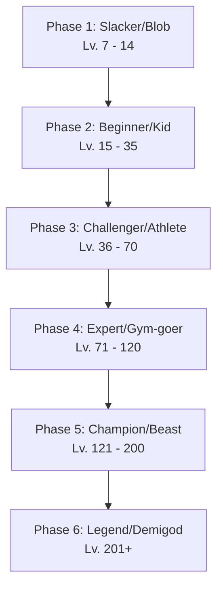
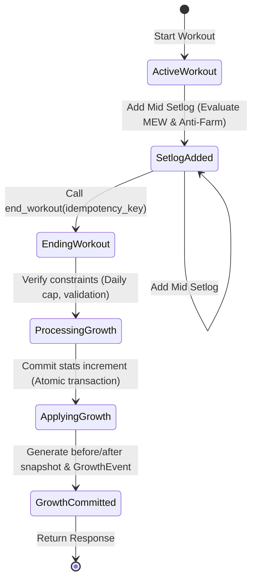

# Character V2 Art Brief & Growth Rules Design

This document details the visual and mathematical specification for the Character V2 overhaul. It defines the character art requirements, the server-authoritative growth mechanics, and the data contract specifications required for frontend and backend implementation.

---

## 1. Naming Drift Cleanup

### Current State Analysis
A comparison of the current database models and the frontend codebase reveals naming discrepancies in body parts:
*   **Backend Taxonomy (`backend/models.py`, `backend/routers/stats.py`)**: Uses the keys `chest`, `back`, `legs`, `shoulders`, `arms`, `core`, and `stamina`.
*   **Frontend Translation (`CharacterPreview.tsx`)**: Defines display mapping for `abs` and `cardio`, but does not define translations for `core` and `stamina`. This causes raw, untranslated keys (`core` and `stamina`) to appear on the UI.
*   **Frontend pages (`WorkoutPage.tsx`, `PartyRoomPage.tsx`)**: Attempt to resolve this locally by mapping both `core/abs` and `stamina/cardio` to common Korean terms ("코어", "유산소").

### Canonical Taxonomy Resolution
To eliminate drift, we define a unified **Canonical 7-Body-Part Taxonomy** to be enforced across the database, APIs, and client-side code:

| Canonical Key | Korean Label | Icon / Emoji | V1 Legacy Key mapping | Notes |
| :--- | :--- | :--- | :--- | :--- |
| `chest` | 가슴 | 🦾 | `chest` | Pectorals |
| `back` | 등 | 🔙 | `back` | Latissimus dorsi, traps |
| `shoulders` | 어깨 | 💪 | `shoulders` | Deltoids |
| `arms` | 팔 | 💪 | `arms` | Biceps, triceps, forearms |
| `legs` | 하체 | 🦵 | `legs` | Quads, hamstrings, calves |
| `core` | 코어 | 🏋️ | `core` (DB) / `abs` (FE) | Rectus abdominis, obliques |
| `cardio` | 유산소 | 🫀 | `stamina` (DB) / `cardio` (FE) | Cardiovascular endurance |

> [!IMPORTANT]
> The backend database schema must migrate its CheckConstraint to validate `cardio` instead of `stamina`. All existing records with `part = 'stamina'` must be updated to `part = 'cardio'`. The frontend must align all label and emoji objects to use the Canonical Keys.

---

## 2. Visual Art Brief & Visual Options Comparison

We propose migrating from third-party remote avatars (DiceBear) to custom-designed, version-controlled 2D character assets. 

### Visual Option Comparison

We compare three visual styles for the character assets:

| Dimension | Option A: Retro Pixel Art (Recommended) | Option B: Modern Vector Flat | Option C: Stylized Hand-Drawn Anime |
| :--- | :--- | :--- | :--- |
| **Aesthetic Theme** | Retro 16-bit gaming, arcade style | Sleek, clean, corporate-minimalist | Dynamic manga/webtoon comic |
| **User Affinity** | High (evokes classic RPG gamification) | Medium (clean but feels less like a game) | High (appealing to anime/gaming fans) |
| **Production Cost** | **Low to Medium** (pixel assets are quick to draft) | **Medium** (requires clean vector curves) | **High** (requires detailed shading & linework) |
| **Extensibility** | **Very High** (modular pixel layers are easy to align) | **Medium** (requires careful scaling/points) | **Low** (modifications require redrawing poses) |
| **Recommendation** | **Recommended** for initial Beta release. | Strong alternative for a lifestyle look. | Postponed due to cost and low extensibility. |

---

### Evolution Phases (6 Stages)
The character progresses through 6 distinct visual evolution stages based on the character's **Total Level** (sum of all canonical body part levels):



1.  **Phase 1: Slacker / Blob (Total Lv. 7 - 14)**: A soft, round blob or gelatinous shape. Expression is sleepy or passive. Grayscale/dull palette.
2.  **Phase 2: Beginner / Kid (Total Lv. 15 - 35)**: Simple limbs appear. Character stands on two legs. Determined look, basic colors.
3.  **Phase 3: Challenger / Athlete (Total Lv. 36 - 70)**: Defined athletic frame. Highlights matching the highest body stat color.
4.  **Phase 4: Expert / Gym-goer (Total Lv. 71 - 120)**: Highly muscular torso. Focused expression with minor sweat animations.
5.  **Phase 5: Champion / Beast (Total Lv. 121 - 200)**: Giant proportions, glowing aura, intense fire-eyes expression.
6.  **Phase 6: Legend / Demigod (Total Lv. 201+)**: Divine workout armor, particle effects (energy wings/sparkles), calm confidence.

### Silhouette, Expression, and Color Palette Principles
*   **Silhouette**: Progression must show a clear transition from *rounded/low-contrast shapes* in Phase 1 to *sharp, wide-shouldered, V-taper shapes* in later phases.
*   **Expression**: Sleepy/Unmotivated $\rightarrow$ Focused $\rightarrow$ Burning Passion $\rightarrow$ Transcendental/Confident.
*   **Color Palette Integration**: The base character is neutral. However, the glowing accent lines or aura color dynamically adapts to the character's **highest level body part**:
    *   `chest` $\rightarrow$ Fiery Red
    *   `back` $\rightarrow$ Deep Green
    *   `legs` $\rightarrow$ Earthy Brown
    *   `shoulders` $\rightarrow$ Electric Purple
    *   `arms` $\rightarrow$ Amber Orange
    *   `core` $\rightarrow$ Steel Gray
    *   `cardio` $\rightarrow$ Vibrant Teal
*   **Cosmetics**: In the beta, we avoid full 7-part dynamic combination rendering. Instead, we render the pre-drawn Phase sprite and overlay a single selected cosmetic item (e.g., Headband, Sunglasses, Wristwraps) placed on fixed coordinate anchor points per Phase.

### Accessible Text Fallback
For accessibility (screen readers) or textual logs, the system must generate a dynamic text descriptor:
`"[Phase Name] Character (Total Lv. {total_level}, Primary: {max_part_name} Lv. {max_part_level})"`
*Example:* `Challenger Athlete Character (Total Lv. 52, Primary: Cardio Lv. 12)`

---

## 3. Server-Authoritative Growth Rules

To prevent front-end client spoofing, character progression and level calculations must run strictly on the backend.

### Workout Validation and Input Rules
1.  **Minimum Effective Workout (MEW)**: To trigger growth, a workout session must:
    *   Last at least **5 minutes** (`ended_at - started_at >= 300` seconds).
    *   Contain at least **1 valid `mid` setlog** with a parsed exercise block.
2.  **Max Workout Duration**: Workouts lasting longer than **180 minutes** (`10800` seconds) will have their XP calculation capped at the 180-minute mark to prevent idle XP farming.

### XP/Potential Formulas
1.  **Setlog Parsing**:
    *   The backend parses the string content of each `mid` setlog using keyword mapping to map exercises to canonical body parts.
    *   Each unique, valid set registered in a setlog yields **5 XP** (equivalent to 5 potential points) for the associated body part.
2.  **Anti-Farming & Anti-Abuse**:
    *   **Time-Interval Threshold**: Consecutive setlogs must be separated by at least **30 seconds** (`created_at` delta). Setlogs submitted within 30 seconds of the previous one will not yield XP.
    *   **Content Similarity**: Consecutive setlogs with identical text contents are ignored to prevent copy-paste exploits.
    *   **Workout Cap**: A single workout can yield a maximum of **40 XP** per body part, and a maximum of **100 XP** total.
    *   **Daily Cap**: A user can earn at most **200 XP** total per calendar day (UTC).

### Level Progression Curve
Unlike V1's flat 100 potential points per level, V2 introduces a progressive leveling curve to reward long-term progression. The XP required to advance from Level $L$ to $L+1$ for any body part is calculated as:

$$XP_{required}(L) = 100 + (L - 1) \times 10$$

```
Level 1 -> 2: 100 XP
Level 2 -> 3: 110 XP
Level 3 -> 4: 120 XP
...
Level 50 -> 51: 590 XP
```

---

## 4. `GrowthEvent` Schema & Idempotence Contracts

### Growth State Machine
The growth state transitions occur when a workout is finalized.



### Invariant Conditions
*   **Monotonicity**: $Level_{after} \ge Level_{before}$. If $Level_{after} = Level_{before}$, then $Potential_{after} \ge Potential_{before}$.
*   **Single-event per Workout**: A `workout_id` can map to at most one `GrowthEvent` record in the database.

### Idempotency & Retry Contract
*   The `/workouts/{workout_id}/end` endpoint must support an optional header `X-Idempotency-Key` or default to the `workout_id` as the unique operation token.
*   If a request to end a workout is received, the server checks the workout status:
    *   If `status == 'active'`, the server processes the growth, sets `status = 'ended'`, creates the `GrowthEvent` record, and returns HTTP 201.
    *   If `status == 'ended'`, the server does **not** recalculate growth. Instead, it queries the existing `GrowthEvent` and returns the cached `WorkoutEndResponse` with HTTP 200.

### Legacy Data Migration
For users with existing V1 levels and potentials, we migrate the data by converting all accumulated potential to absolute XP, then applying the new progressive scale:

1.  **Calculate Total V1 XP**:
    $$XP_{accumulated} = (Level_{old} - 1) \times 100 + Potential_{old}$$
2.  **Re-allocate using V2 Curve**:
    Initialize $Level_{new} = 1$, $RemainingXP = XP_{accumulated}$.
    While $RemainingXP \ge (100 + (Level_{new} - 1) \times 10)$:
    *   Subtract $(100 + (Level_{new} - 1) \times 10)$ from $RemainingXP$.
    *   Increment $Level_{new}$ by 1.
3.  Set $Potential_{new} = RemainingXP$.

---

## 5. Asset Manifest & Licensing

### Manifest Schema (`asset-manifest.json`)
All custom 2D characters and cosmetic files must be cataloged in a local JSON manifest to track licensing and integrity:

```json
{
  "manifest_version": "2.0.0",
  "assets": [
    {
      "id": "char_p1_slacker",
      "file_path": "assets/characters/p1_slacker.png",
      "hash": "sha256:d8a5563e8a513511116235b2e987c889f8d91c12be87998b31a15321ab9102c9",
      "creator": "In-house Art Team",
      "source": "hell-setlog-design",
      "license": "Proprietary",
      "attribution": "Copyright 2026 Hell Setlog Inc.",
      "version": "1.0.0",
      "metadata": {
        "phase": 1,
        "recommended_resolution": "512x512"
      }
    }
  ],
  "approval_workflow": {
    "required_approvals": ["ArtDirector", "LegalCounsel"],
    "registry_url": "https://internal.hellsetlog.com/registry/assets"
  }
}
```

### DiceBear 7.x Removal and Emergency Fallback Policy
1.  **Removal**: All frontend references to `api.dicebear.com` must be deleted.
2.  **Emergency Local Fallback**: If a character asset fails to load, or if the user profile is rendered offline, the frontend will execute a local SVG generator component (`LocalAvatar.tsx`) which outputs a stylized SVG badge using the user's initial and their highest body stat accent color. No third-party network requests are permitted.
3.  **Commercial Compliance**: To ensure compliance with commercial guidelines, all assets must be locally hosted inside the application bundle (or via the app's own CDN). No external remote APIs (like unverified avatar providers) are permitted.

---

## 6. Draft Database Schemas & API Contracts

### SQL Schemas (PostgreSQL/SQLAlchemy)

```python
class GrowthEvent(Base):
    __tablename__ = "growth_events"

    id = Column(Integer, primary_key=True, index=True)
    workout_id = Column(Integer, ForeignKey("workouts.id"), nullable=False, unique=True)
    character_id = Column(Integer, ForeignKey("characters.id"), nullable=False)
    idempotency_key = Column(String(50), nullable=True, unique=True)
    
    # Growth snapshots stored as JSON
    before_snapshot = Column(JSON, nullable=False)
    after_snapshot = Column(JSON, nullable=False)
    
    created_at = Column(DateTime, default=utcnow, nullable=False)
```

### API Contracts

#### POST `/api/workouts/{workout_id}/end`
*   **Request Headers**:
    *   `X-Idempotency-Key`: `string` (UUID v4)
*   **Response Body (`WorkoutEndResponse`)**:
    ```json
    {
      "workout_id": 104,
      "status": "ended",
      "duration_seconds": 1820,
      "setlog_count": 5,
      "breakthroughs": [
        {
          "part": "cardio",
          "old_level": 8,
          "new_level": 9
        }
      ],
      "body_stats": [
        {
          "part": "chest",
          "level": 12,
          "potential": 45
        },
        {
          "part": "cardio",
          "level": 9,
          "potential": 10
        }
      ],
      "character_phase": {
        "current_phase": 2,
        "name": "Beginner Kid",
        "fallback_text": "Beginner Kid Character (Total Lv. 21, Primary: Chest Lv. 12)"
      }
    }
    ```
